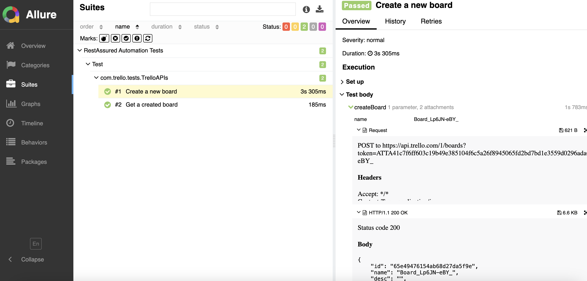

# RestAssuredTestNGFramework
REST Assured API test automation framework using Java + Maven + TestNG + Allure report

Technologies/Tools used in building the framework
=================================================
- Java 11
- Rest Assured
- Maven
- TestNG
- Allure Reports

# Run Tests
```
mvn clean test -DsuiteFile="src/test/resources/suites/regression.xml"
```

# Generate Allure Report
```
allure generate --single-file allure-results --clean
```
The report will be generated in allure-report folder with name is index.html file


